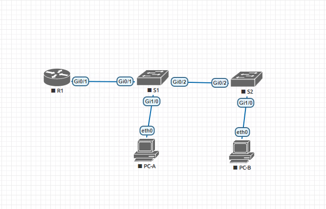
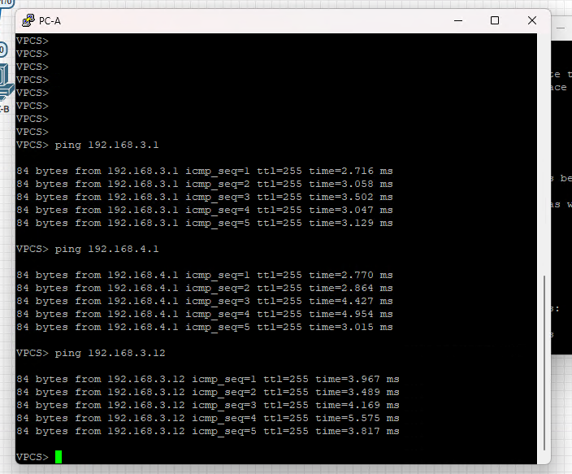
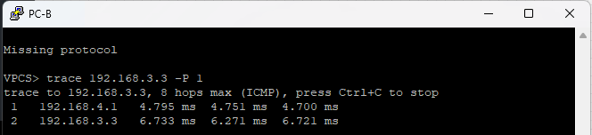

### Lab - Configure Router-on-a-Stick Inter-VLAN Routing 

##### Задачи:
    1.Создайте сеть и настройте основные параметры устройства
    2.Создайте VLAN и назначьте порты коммутатора
    3.Настройте магистраль 802.1Q Между коммутаторами
    4.Настройка маршрутизации между VLAN на маршрутизаторе
    5.Убедитесь, что маршрутизация между VLAN работает


### 1.Создайте сеть и настройте основные параметры устройства: 
            1. Строим сеть согласно топологии в EVE.NG



        2.Настраиваем основныем параметры маршрутизатора и коммутатор + ПК согласно таблицам адресации и vlan        

    Пример настройки:
    - Маршрутизатоор и коммутатор настраиваются аналогично
```
        en
        conf ter
        hostname R1
        no ip domain-lookup
        enable secret class
        line 0
        password cisco
        login
        line vty 0 15
        password cisco
        login
        service password-encryption
        banner motd "unauthorized access is prohibited"
        clock set 17:15:00 4 apr 2024
        copy running-config startup-config
```
    - Настройка PC-A
        ip 192.168.3.1/24 192.168.3.1

### 2.Создайте VLAN и назначьте порты коммутатора
        Шаг1: Создайте VLAN на обоих коммутаторах
        Пример настройки:

        S1
```
    en
        conf ter
            vlan 3
            name Managment
            vlan 4 
            name Operations
            vlan 7
            name ParkingLot
            vlan 8
            name Native
 ```       

        Шаг2: Назначьте VLAN правильным интерфейсам коммутатора
        Пример настройки:

        S1
```        
    en
        conf ter
        interface vlan 3 
            ip address 192.168.3.11 255.255.255.0

        ip default-gateway 192.168.3.1

        interface range gi0/0, gi0/3, gi1/1
            switchport mode access
            switchport access vlan 7
            shutdown
        interface gi1/0
            description PC-A
            switchport mode access
            switchport access vlan 3
```
### 3.Настройте 802.1Q Между коммутаторами
         Шаг1: Настройка портов на S1 и S2 Gi0/2
        Пример настройки:
```    
        S1
    en
        conf ter
           interface GigabitEthernet0/2
            description to_S2_Gi0/2
            switchport trunk allowed vlan 3,4,8
            switchport trunk encapsulation dot1q
            switchport trunk native vlan 8
            switchport mode trunk
```
        Шаг2: Настройка порта на S1 Gi0/1
```
        S1
    en
        conf ter
           interface GigabitEthernet0/1
            description to_R1_Gi0/
            switchport trunk allowed vlan 3,4,8
            switchport trunk encapsulation dot1q
            switchport trunk native vlan 8
            switchport mode trunk
```


### 4.Настройка маршрутизации между VLAN на маршрутизаторе
        Шаг1: Настройка R1
        Пример настройки:
```    
        R1
    en
        conf ter
            interface gi0/1.3
            description Managment
            encapsulation dot1Q 3
            ip address 192.168.3.1 255.255.255.0
            exit

            nterface gi0/1.4
            description Operation
            encapsulation dot1Q 4
            ip address 192.168.4.1 255.255.255.0
            exit

            nterface gi0/1.8
            description Native
            encapsulation dot1Q 8 native
            ip address 192.168.8.1 255.255.255.0
            exit
```


 ### 5.Проверка работы
        Шаг1: выпонить пинги с PC-A до шлюза, PC-B и S2:



        Шаг2: выпонить trace с PC-B до PC-A:
        



### Таблица адресации

    | Устройство  | Интерфес | IP адрес     | Маска          | Шлюз       |
    |-------------|-------------------------|----------------|------------|
    | R1          | G0/1.3   | 192.168.3.1  | 255.2555.255.0 | N/A        |
    | R1          | G0/1.4   | 192.168.4.1  | 255.2555.255.0 | N/A        |
    | R1          | G0/1.8   | N/A          | N/A            | N/A        |
    |-------------|-------------------------|----------------|------------|
    | S1          | Vlan3    | 192.168.3.11 | 255.2555.255.0 | 192.168.3.1|
    | S2          | Vlan3    | 192.168.3.12 | 255.2555.255.0 | 192.168.3.1|
    | PC-A        | NIC      | 192.168.3.3  | 255.2555.255.0 | 192.168.3.1|
    | PC-B        | NIC      | 192.168.4.3  | 255.2555.255.0 | 192.168.4.1|
    |-------------|-------------------------|----------------|------------|


### Таблица VLAN

    | Vlan        | Имя        |  Назначен интерфейс          |
    |-------------|------------|------------------------------|
    | 3           | Managmenet | S1: VLAN 3                   |
    |             | Managmenet | S2: VLAN 3                   |
    |             | Managmenet | S1: Gi1/0                    |
    |-------------|------------|------------------------------|
    | 4           | Operations | S2: Gi1/0                    |
    |-------------|------------|------------------------------|
    | 7           | ParkingLot | S1: Gi0/0 Gi0/3 Gi1/1        |
    |             | ParkingLot | S2: Gi0/0 Gi0/1 Gi0/3 Gi1/1  |
    |-------------|------------|------------------------------|
    | 8           | Native     | N/A                          |
    |-------------|------------|------------------------------|


 ### Схема сети и ссылка на финальный конфиг устройств:


1. [Схема сети](lab01-vlan.png).   

2. [Конфигурации устройств](configs/).
