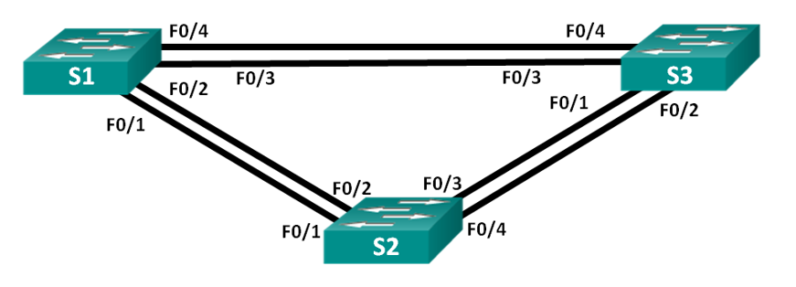

### Лабораторная работа. Развертывание коммутируемой сети с резервными каналами 

#### Топология


#### Таблица адресации:

    |-------------|------------|-------------|---------------|
    | Устройство  | Интерфейс  | IP-адрес    | Маска подсети |
    |-------------|------------|-------------|---------------|
    |  S1         |  VLAN 1    | 192.168.1.1 |255.255.255.0  |
    |-------------|------------|-------------|---------------|
    |  S2         |  VLAN 1    | 192.168.1.2 |255.255.255.0  |
    |-------------|------------|-------------|---------------|
    |  S3         |  VLAN 1    | 192.168.1.3 |255.255.255.0  |
    |-------------|------------|-------------|---------------|


##### Цели:
    Часть 1. Создание сети и настройка основных параметров устройства
    Часть 2. Выбор корневого моста
    Часть 3. Наблюдение за процессом выбора протоколом STP порта, исходя из стоимости портов
    Часть 4. Наблюдение за процессом выбора протоколом STP порта, исходя из приоритета портов


 ###    ЧАСТЬ 1. Создание сети и настройка основных параметров
 ##### Лабораторная работа проводилась в Cisco Pacet Trace
    Пример настройки одного из коммутаторов:

```
en
    conf ter
    hostname S1
    no ip domain-lookup
    enable secret class
line 0
    password cisco
    logging synchronous
    login
line vty 0 4
    password cisco
    login
line vty 5 15
    password cisco
    login

banner motd "unauthorized access is prohibited"

interface vlan 1
    ip address 192.168.1.1 255.255.255.0
    no shutdown

copy running-config startup-config

```

###    ЧАСТЬ 2. Определение корневого моста

#### шаг 1: Отключите все порты на коммутаторах.

```

```


#### Шаг 2:	Настройте подключенные порты в качестве транковых.

```

```
#### Шаг 3:	Включите порты F0/2 и F0/4 на всех коммутаторах.

```

```
#### Шаг 4:	Отобразите данные протокола spanning-tree.

```

```


С учетом выходных данных, поступающих с коммутаторов, ответьте на следующие вопросы:

    1.Какой коммутатор является корневым мостом? ______________
    2.Почему этот коммутатор был выбран протоколом spanning-tree в качестве корневого моста?
    _______________________________________________________________________________________
    _______________________________________________________________________________________
    3.Какие порты на коммутаторе являются корневыми портами? ___________________________________
    4.Какие порты на коммутаторе являются назначенными портами? ________________________________
    5.Какой порт отображается в качестве альтернативного и в настоящее время заблокирован? ____________________________
    6.Почему протокол spanning-tree выбрал этот порт в качестве невыделенного (заблокированного) порта?

