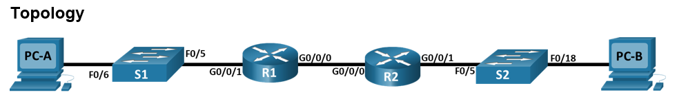

### 7.4.2 Внедрение DHCPv4

#### Топология

#### Таблица адресации:

| Устройство  | Интерфес     | IP адрес     | Маска          | Шлюз       |
|-------------|--------------|--------------|----------------|------------|
| R1          | G0/0/0/      | 192.168.3.1  | 255.2555.255.0 | N/A        |
|             | G0/0/1       | 192.168.4.1  | 255.2555.255.0 | N/A        |
|             | G0/0/1.100   | N/A          | N/A            | N/A        |

|-------------|-------------------------|----------------|------------|

#### Таблица VLAN:

### Цель:
Часть 1. Построение сети и настройка основных параметров устройства
Часть 2: Настройка и проверка двух серверов DHCPv4 на R1
Часть 3: Настройка и проверка DHCP-ретранслятора на R2
