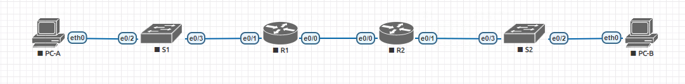

### 7.4.2 Внедрение DHCPv4

#### Топология

#### Таблица адресации:

| Устройство  | Интерфес     | IP адрес     | Маска          | Шлюз        |
|-------------|--------------|--------------|----------------|-------------|
| R1          | e0/0         | 192.168.3.1  | 255.2555.255.0 | N/A         |
|             | e0/1         |     N/A      |     N/A        | N/A         |
|             | e0/1.100     | 192.168.1.1  |255.255.255.192 | N/A         |
|             | e0/1.200     | 192.168.1.65 |255.255.255.224 | N/A         |
|             | e0/1.1000    |      N/A     |      N/A       | N/A         |
|-------------|-----------------------------|----------------|-------------|
| R2          | e0/0         | 10.0.0.2     | 255.2555.255.0 | N/A         |
|             | e0/1         | 192.168.1.97 | 255.255.255.240| N/A         |
|-------------|-----------------------------|----------------|-------------|
| S1          | vlan200      | 192.168.1.66 | 255.255.255.224|192.168.1.65 |
|-------------|-----------------------------|----------------|------------ |
| S2          | vlan1        |              |                |             |
|-------------|-----------------------------|----------------|-------------|
| PC-A        | NIC          |    DHCP      |      DHCP      |   DHCP      |
| PC-B        | NIC          |    DHCP      |      DHCP      |   DHCP      |

#### Таблица VLAN:

| VLAN     | Name         | Interface Assigned          |
|----------|--------------|-----------------------------|
| 1        | N/A          | S2: e0/2                    |
| 100      | Clients      | S1: e0/2                    |
| 200      | Managment    | S1: Vlan200                 |
| 999      | Parking Lot  | S1: e0/0, e0/1              |
| 1000     | Nativ        | N/A                         |

### Цель:
    Часть 1. Построение сети и настройка основных параметров устройства
    Часть 2: Настройка и проверка двух серверов DHCPv4 на R1
    Часть 3: Настройка и проверка DHCP-ретранслятора на R2

#### Часть 1: Создайте сеть и настройте основные параметры.

##### Шаг 1: Установите схему адресации.

    Подсеть сети 192.168.1.0/24 должна соответствовать следующим требованиям:
    a.	Одна подсеть, “Подсеть A”, поддерживающая 58 хостов (клиентская VLAN на R1).
    Подсеть A:  192.168.1.0/26
    Запишите первый IP-адрес в таблицу адресации для R1 e0/1.100. 

    b.	Одна подсеть, “Подсеть B”, поддерживающая 28 хостов (управляющая VLAN на R1). 
    Подсеть B: 192.168.1.64/27
    Запишите первый IP-адрес в таблицу адресации для R1 e0/1.200. 
    Запишите второй IP-адрес в таблицу адресов для S1 VLAN 200 и введите соответствующий шлюз по умолчанию.

    c.	Одна подсеть, “Подсеть C”, поддерживающая 12 хостов (клиентская сеть на уровне R2).
    Подсеть C: 192.168.1.96/28
    Запишите первый IP-адрес в таблицу адресации для R2 e0/1.

##### Шаг 2: Подключите сеть, как показано на топологии.

##### Шаг 3: Настройте основные параметры для каждого маршрутизатора.

    a.	Присвойте маршрутизатору имя устройства.
    Открыть окно конфигурации
    b.	Отключите поиск DNS, чтобы маршрутизатор не пытался перевести неправильно введенные команды, как если бы они были именами хостов.
    c.	Назначьте класс в качестве привилегированного зашифрованного пароля EXEC.
    d.	Назначьте cisco в качестве пароля консоли и включите вход в систему.
    e.	Назначьте cisco в качестве пароля VTY и включите вход в систему.
    f.	Зашифруйте пароли открытым текстом.
    g.	Создайте баннер, предупреждающий любого пользователя устройства о том, что несанкционированный доступ запрещен.
    h.	Сохраните текущую конфигурацию в файле конфигурации запуска.
    i.	Установите часы на маршрутизаторе на сегодняшнее время и дату.

