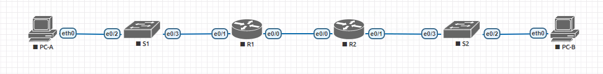
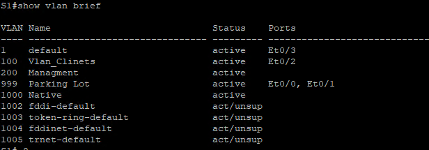
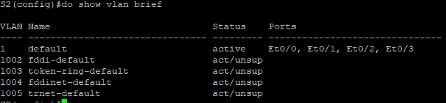
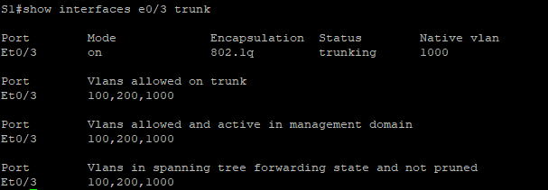

### 7.4.2 Внедрение DHCPv4

#### Топология


#### Таблица адресации:

| Устройство  | Интерфес     | IP адрес     | Маска          | Шлюз        |
|-------------|--------------|--------------|----------------|-------------|
| R1          | e0/0         | 10.0.0.1     | 255.255.255.252| N/A         |
|             | e0/1         |     N/A      |     N/A        | N/A         |
|             | e0/1.100     | 192.168.1.1  |255.255.255.192 | N/A         |
|             | e0/1.200     | 192.168.1.65 |255.255.255.224 | N/A         |
|             | e0/1.1000    |      N/A     |      N/A       | N/A         |
|-------------|-----------------------------|----------------|-------------|
| R2          | e0/0         | 10.0.0.2     |255.2555.255.252| N/A         |
|             | e0/1         | 192.168.1.97 | 255.255.255.240| N/A         |
|-------------|-----------------------------|----------------|-------------|
| S1          | vlan200      | 192.168.1.66 | 255.255.255.224|192.168.1.65 |
|-------------|-----------------------------|----------------|------------ |
| S2          | vlan1        |192.168.1.98  | 255.255.255.240|192.168.1.97 |
|-------------|-----------------------------|----------------|-------------|
| PC-A        | NIC          |    DHCP      |      DHCP      |   DHCP      |
| PC-B        | NIC          |    DHCP      |      DHCP      |   DHCP      |


#### Таблица VLAN:

| VLAN     | Name         | Interface Assigned          |
|----------|--------------|-----------------------------|
| 1        | N/A          | S2: e0/2                    |
| 100      | Clients      | S1: e0/2                    |
| 200      | Managment    | S1: Vlan200                 |
| 999      | Parking Lot  | S1: e0/0, e0/1              |
| 1000     | Nativ        | N/A                         |


### Цель:
    Часть 1. Построение сети и настройка основных параметров устройства
    Часть 2: Настройка и проверка двух серверов DHCPv4 на R1
    Часть 3: Настройка и проверка DHCP-ретранслятора на R2


### Часть 1: Создайте сеть и настройте основные параметры.

##### Шаг 1: Установите схему адресации.

    Подсеть сети 192.168.1.0/24 должна соответствовать следующим требованиям:
    a.	Одна подсеть, “Подсеть A”, поддерживающая 58 хостов (клиентская VLAN на R1).
    Подсеть A:  192.168.1.0/26
    Запишите первый IP-адрес в таблицу адресации для R1 e0/1.100. 

    b.	Одна подсеть, “Подсеть B”, поддерживающая 28 хостов (управляющая VLAN на R1). 
    Подсеть B: 192.168.1.64/27
    Запишите первый IP-адрес в таблицу адресации для R1 e0/1.200. 
    Запишите второй IP-адрес в таблицу адресов для S1 VLAN 200 и введите соответствующий шлюз по умолчанию.

    c.	Одна подсеть, “Подсеть C”, поддерживающая 12 хостов (клиентская сеть на уровне R2).
    Подсеть C: 192.168.1.96/28
    Запишите первый IP-адрес в таблицу адресации для R2 e0/1.

##### Шаг 2: Подключите сеть, как показано на топологии.


##### Шаг 3: Настройте основные параметры для каждого маршрутизатора.

    a.	Присвойте маршрутизатору имя устройства.
    Открыть окно конфигурации
    b.	Отключите поиск DNS, чтобы маршрутизатор не пытался перевести неправильно введенные команды.
    c.	Назначьте class в качестве привилегированного зашифрованного пароля EXEC.
    d.	Назначьте cisco в качестве пароля консоли и включите вход в систему.
    e.	Назначьте cisco в качестве пароля VTY и включите вход в систему.
    f.	Зашифруйте пароли открытым текстом.
    g.	Создайте баннер, предупреждающий любого пользователя устройства о том, что несанкционированный доступ запрещен.
    h.	Сохраните текущую конфигурацию в файле конфигурации запуска.
    i.	Установите часы на маршрутизаторе на сегодняшнее время и дату.

#### Пример:
    en
    conf ter
        hostname R1
        no ip domain lookup
        enable secret class
        line console 0
        password cisco
        loging
        line vty 0 4
        password cisco
        login
        service password-encryption
        banner motd "unauthorized access is prohibited"
        copy running-config startup-config
        clock set 14:30:00 28 apr 2024
##### Шаг 4: Настройте маршрутизацию между VLAN на R1.

##### a.	Активируйте интерфейс G0/0/1 на маршрутизаторе.
##### b.	Настройте вспомогательные интерфейсы для каждой VLAN в соответствии с требованиями таблицы IP-адресации. Все субинтерфейсы используют инкапсуляцию 802.1Q, и им назначается первый полезный адрес из вычисленного вами пула IP-адресов. Убедитесь, что субинтерфейсу для собственной VLAN не назначен IP-адрес. Включите описание для каждого подинтерфейса.
##### c.	Vубедитесь, что вспомогательные интерфейсы работают.
```
    en
    conf ter
    interface e0/1 
    no shutdown

    interface e0/1.100
    description Vlan100_Clients
    encapsulation dot1Q 100
    ip address 192.168.1.1 255.255.255.192

    interface e0/1.200
    description Managment
    encapsulation dot1Q 200
    ip address 192.168.1.65 255.255.255.224

    interface e0/1.1000
    description Native
    encapsulation dot1Q 1000 native
```
```
    R1#show ip interface brief
Interface                  IP-Address      OK? Method Status             Protocol
Ethernet0/0                unassigned      YES unset  administratively down down 
Ethernet0/1                unassigned      YES unset  up                     up
Ethernet0/1.100            192.168.1.1     YES manual up                     up  
Ethernet0/1.200            192.168.1.65    YES manual up                     up  
Ethernet0/1.1000           unassigned      YES unset  up                     up  
Ethernet0/2                unassigned      YES unset  administratively down down 
Ethernet0/3                unassigned      YES unset  administratively down down 

```

##### Шаг 5: Настройте e/0/1 на R2, затем e0/0 и статическую маршрутизацию для обоих маршрутизаторов.
```
a.	Настройте e0/1 на R2 с первым IP-адресом подсети C, который вы рассчитали ранее.
b.	Настройте интерфейс e0/0 для каждого маршрутизатора на основе приведенной выше таблицы IP-адресации.
c.	Настройте маршрут по умолчанию на каждом маршрутизаторе, указывающем на IP-адрес e0/0 на другом маршрутизаторе.
d.	Убедитесь, что статическая маршрутизация работает, отправив запрос на адрес R2 e0/1 из R1.
e.	Сохраните текущую конфигурацию в файле конфигурации запуска.
```
#### R2
    en 
    conf ter
    interface e0/1
    ip address 192.168.1.97 255.255.255.240
    no shutdown

#### R1
    en 
    conf ter
    interface e0/0
    ip address 10.0.0.1 255.255.255.252
    no shutdown
#### R2
    en 
    conf ter
    interface e0/0
    ip address 10.0.0.2 255.255.255.252
    no shutdown
#### R1
    en
    conf ter
    ip route 0.0.0.0 0.0.0.0 10.0.0.2  

#### R2
    en
    conf ter
    ip route 0.0.0.0 0.0.0.0 10.0.0.1      

#### R1# 
    ping 192.168.1.97
    Type escape sequence to abort.
    Sending 5, 100-byte ICMP Echos to 192.168.1.97, timeout is 2 seconds:
    !!!!!
    Success rate is 100 percent (5/5), round-trip min/avg/max = 1/1/1 ms


##### Шаг 6: Настройте основные параметры для каждого коммутатора.
###### Все настройки анологичны Шагу 3:
    en
        conf ter
            hostname S1
            no ip domain lookup
            enable secret class
            line console 0
            password cisco
            loging
            line vty 0 4
            password cisco
            login
            service password-encryption
            banner motd "unauthorized access is prohibited"
            copy running-config startup-config
            clock set 14:30:00 28 apr 2024

##### Шаг 7: Создайте VLAN на S1. 

    Примечание: S2 настраивается только с базовыми настройками.
    a.	Создайте и назовите необходимые сети VLAN на коммутаторе 1 из приведенной выше таблицы.
    b.	Настройте и активируйте интерфейс управления на S1 (VLAN 200), используя второй IP-адрес из подсети, рассчитанный ранее. Дополнительно, установите шлюз по умолчанию на S1.
    c.	Настройте и активируйте интерфейс управления на S2 (VLAN 1), используя второй IP-адрес из подсети, рассчитанный ранее. Дополнительно, установите шлюз по умолчанию на S2
    d.	Назначьте все неиспользуемые порты на S1 для Parking_Lot VLAN, настройте их для режима статического доступа и деактивируйте их в административном порядке. На S2 отключите все неиспользуемые порты в административном порядке.
    
```
    S1
    en
    conf ter
    vlan 100
    name Vlan_clients
    vlan 200
    name Managment
    vlan 999
    name Parking Lot
    interface vlan 1000
    name Native
    interface vlan 200
    ip address 192.168.1.66 255.255.255.224
    ip default-gateway 192.168.1.65
    copy running-config startup-config
```

```
    S2
    en
    conf ter
    interface vlan 1
    ip address 192.168.1.98 255.255.255.224
    ip default-gateway 192.168.1.97
    copy running-config startup-config
```
```
    S1
    en
    conf ter
    interface range e0/0-1
    switchportr mode access
    switchport access vlan 999
    shutdown
    copy running-config startup-config
```
```
    S2
    en
    conf ter
    interface range e0/0-1
    shutdown
    copy running-config startup-config
```

##### Шаг 8: Назначьте VLAN правильным интерфейсам коммутатора.
    a.	Назначьте используемые порты соответствующей VLAN (указанной в таблице VLAN выше) и настройте их для режима статического доступа.
    
#### S1
    en
    conf ter
    interface e0/2
    switchport mode access
    switchport access vlan 100

#### S2
    en
    en
    conf ter
    interface e0/2
    switchport mode access
    switchport access vlan 1


    b.	Убедитесь, что сети VLAN назначены правильным интерфейсам.
    
S1



S2



   Вопрос: Почему интерфейс e0/2 указан в разделе VLAN 1?

   ###### Так как на S2 не создано вланов, то на интерфейс e0/2 подан единственный существующий Vlan 1 на коммутатооре. Так же он является дефолтным и для связности с другими утройствами в сети его будет достаточно.


   ##### Шаг 9: Вручную настройте интерфейс S1 e0/3 в качестве магистрали 802.1Q

    a.	Измените режим порта коммутатора в интерфейсе на принудительный транкинг.
    b.	Как часть конфигурации магистрали, установите для собственной VLAN значение 1000.
    c.	В качестве другой части конфигурации магистрали укажите, что VLAN 100, 200 и 1000  разрешены для пересечения магистрали.
    d.	Сохраните текущую конфигурацию в файле конфигурации запуска.
    e.	Уточнить транкинга.

S1
    en
    conf ter
    interface e0/3
    switchport trunk encapsulation dot1q
    switchport mode trunk
    switchport trunk native vlan 1000
    switchport trunk allowed vlan 100,200,1000
    write


    
Вопрос:
На этом этапе какой IP-адрес был бы у ПК, если бы они были подключены к сети с использованием DHCP?

###### Так как в сети нет DHCP сервера, то пк не получат ip адрес или назначат их себе сами.

### Часть 2: Настройка и проверка двух серверов DHCPv4 на R1.
В части 2 вы будете настраивать и проверять сервер DHCPv4 на R1. Сервер DHCPv4 будет обслуживать две подсети, подсеть A и подсеть C.

##### Шаг 1: Настройте R1 с использованием пулов DHCPv4 для двух поддерживаемых подсетей. Ниже приведен только пул DHCP для подсети A.
    a.	Исключите первые пять полезных адресов из каждого пула адресов.
    Открыть окно конфигурации
    b.	Создайте пул DHCP (используйте уникальное имя для каждого пула).
    c.	Укажите сеть, которую поддерживает этот DHCP-сервер.
    d.	Настройте доменное имя следующим образом ccna-lab.com
    e.	Настройте соответствующий шлюз по умолчанию для каждого пула DHCP.
    f.	Настройте время аренды на 2 дня по 12 часов 30 минут.
    g.	Затем настройте второй пул DHCPv4, используя имя пула R2_Client_LAN и вычисляемую сеть, маршрутизатор по умолчанию, и используйте то же доменное имя и время аренды, что и в предыдущем пуле DHCP.


##### Шаг 2: Сохраните вашу конфигурацию


##### Шаг 3: Проверьте конфигурацию сервера DHCPv4
    a.	Выполните команду показать ip dhcp пула, чтобы просмотреть сведения о пуле.
    b.	Выполните команду показать IP адрес по DHCP привязки изучить установил DHCP-адреса назначения.
    c.	Выполните команду show ip dhcpсервера статистикой для проверки сообщений DHCP.


##### Шаг 4:
    a.	Откройте командную строку на PC-A и выполните команду ipconfig /renew.
    b.	После завершения процесса обновления выполните команду ipconfig, чтобы просмотреть информацию о новом IP.
    c.	Проверьте подключение, отправив запрос на IP-адрес интерфейса R1 G0 / 0 / 1.


### Часть 3: