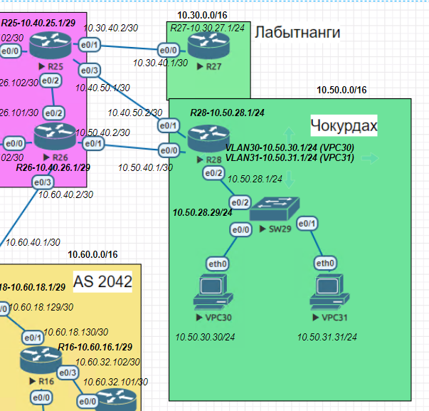
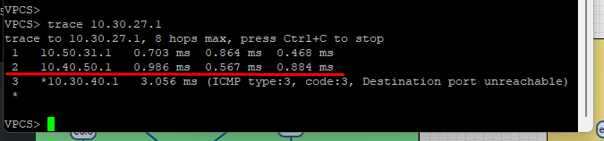
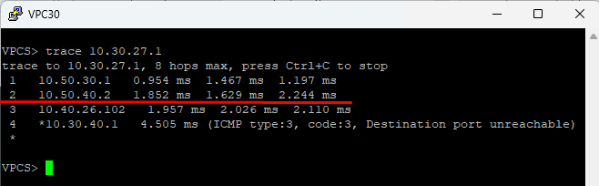
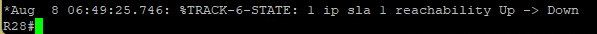
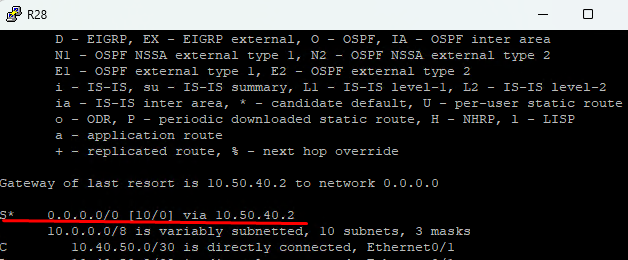
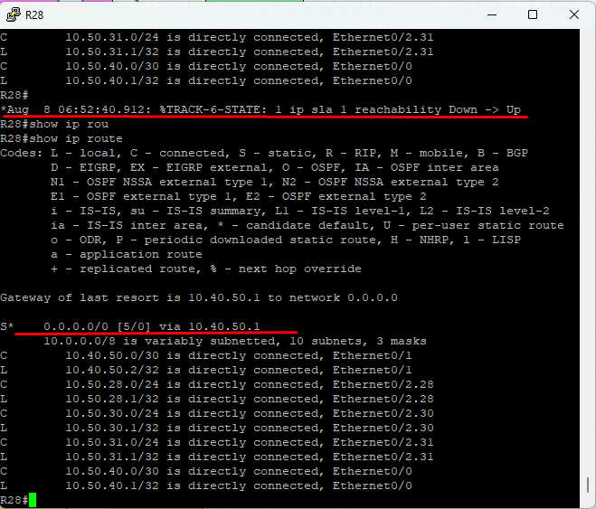

#### PBR
1. [Конфигурации роутеров](configs/).
2. [Схема сети с ip адресами](../../lab/Otus_lab.drawio).

##### Задачи:
```
1.Настроите политику маршрутизации для сетей офиса.
2.Распределите трафик между двумя линками с провайдером.
3.Настроите отслеживание линка через технологию IP SLA.(только для IPv4)
4.Настройте для офиса Лабытнанги маршрут по-умолчанию.
План работы и изменения зафиксированы в документации .
```

```
Так как к задаче я вернулся после натройки isis я сделал редистрбьюцию на R25 и R26 получает информацию о сети 10.30.0.0/16 (Лабытнаги) - эта сеть будет служить в дальнейшем для тестирования настроек в Чокурдах. Так же был создан статический маршрут на R25 до сетей Чокурдах 10.50.0.0/16
```
#### Выполнение работ:

#### 1.Настроите политику маршрутизации для сетей офиса.
```
R28
interface Ethernet0/0
 description to_R26_e0/1
 ip address 10.50.40.1 255.255.255.252
 shutdown
!
interface Ethernet0/1
 description to_R25_e0/3
 ip address 10.40.50.2 255.255.255.252
!
interface Ethernet0/2
 description to_SW29_e0/2
 no ip address
!
interface Ethernet0/2.28
 description SW_29
 encapsulation dot1Q 28
 ip address 10.50.28.1 255.255.255.0
!
interface Ethernet0/2.30
 description VLAN_VPC30
 encapsulation dot1Q 30
 ip address 10.50.30.1 255.255.255.0
!
interface Ethernet0/2.31
 description VLAN_VPC31
 encapsulation dot1Q 31
 ip address 10.50.31.1 255.255.255.0

```
На пк настроена статика, каждый в своем Vlan
```
SW29
interface Ethernet0/0
 description to_VPC30
 switchport access vlan 30
 switchport mode access
!
interface Ethernet0/1
 description to_VPC31
 switchport access vlan 31
 switchport mode access
!
interface Ethernet0/2
 description to_R28_e0/2
 switchport trunk encapsulation dot1q
 switchport mode trunk
!
interface Ethernet0/3
!
interface Vlan28
 ip address 10.50.28.29 255.255.255.0
!
ip forward-protocol nd
!
no ip http server
no ip http secure-server
!
ip route 0.0.0.0 0.0.0.0 10.50.28.1

```
#### 2.Распределите трафик между двумя линками с провайдером.

Сделаем так, что трафик VLan30 VPC30 будет идти через резерв R26, а для Vlan31 VPC31 трафик будет идти через основной маршурт на R25. 

- Настраиваем маршурты по умолчанию на R28 
```
conf ter
ip route 0.0.0.0 0.0.0.0 10.40.50.1 - маршрут до R25 основной
ip route 0.0.0.0 0.0.0.0 10.50.40.2 10 - маршурт до R26 резерв
```
- Создаем access-list на R28, после создаем route-map и матчим к нему access-list и задаем next-hop. Далее применяем на интерфейс для нужного влана, в нашем случае это vlan30

```
R28

ip access-list standard vlan30-ACL
 permit 10.50.30.0 0.0.0.255

route-map vlan30 permit 10
 description RM to R27
 match ip address vlan30
 set ip next-hop 10.50.40.2

interface Ethernet0/2.30
 description VLAN_VPC30
 encapsulation dot1Q 30
 ip address 10.50.30.1 255.255.255.0
```
- Результат: Проверяем трассировкой до loopback Лабытнаги
- VPC31

- трафик идет через R25 для сети 10.50.31.0/24 - vlan31 (VPC31)
- VPC30

- трафик идет через R26 для сети 10.50.30.0/24 - Vlan30 (VPC30)
я так и не понял почему последний прыжок выдает ошибку Destination port unreachable


#### 3. Настроите отслеживание линка через технологию IP SLA.(только для IPv4)
- Настроим sla на R28 - будем проверять пинг до адреса 10.40.50.1 котороый находится на интерфейсе e0/3 R25, в случае его не доступнсти трафик будет уходить на e0/1 R26 - адрес 10.50.40.2
- Создаем sla 1 и прописываем условия, после чего создаем track и привязываем его на статический маршрут.
```
R28
# ip sla 1
    icmp-echo 10.40.50.1 source-ip 10.40.50.2
    threshold 1000
    timeout 1000
    frequency 5
# ip sla schedule 1 life forever start-time now

# track 1 ip sla 1 reachability
    delay down 5 up 5

# ip route 0.0.0.0 0.0.0.0 10.40.50.1 5 track 1
# ip route 0.0.0.0 0.0.0.0 10.50.40.2 10
```
- Проверяем работу: Отключим порт e0/3 на R25, R28 выдаст сообщение

- Смотрим таблицу маршрутизации: основным маршрутом стал резерв 0.0.0.0/0 10.50.40.2

- Поднимаем интерфейс на R25, смотрим результат

- пришло сообщение что ip sla 1 поднялся и маршрут по умолчанию стал 0.0.0.0/0  10.40.50.1

#### 4.Настройте для офиса Лабытнанги маршрут по-умолчанию. 
R27
```
Conf ter
ip route 0.0.0.0 0.0.0.0 10.30.40.2 


```