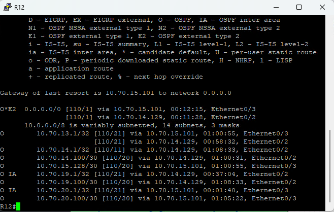
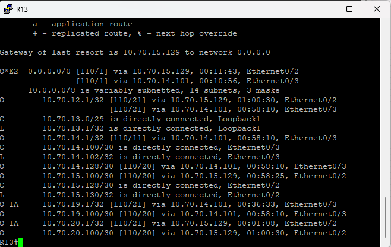

#### OSPF
1. [Таблица ip aдресов](files/).
2. [Схема сети с ip адресами](../../lab/Otus_lab.drawio).
3. [Конфигурации роутеров](configs/).


#### Задачи:
```
1.Маршрутизаторы R14-R15 находятся в зоне 0 - backbone.
2.Маршрутизаторы R12-R13 находятся в зоне 10. Дополнительно к маршрутам должны получать маршрут по умолчанию.
3.Маршрутизатор R19 находится в зоне 101 и получает только маршрут по умолчанию.
4.Маршрутизатор R20 находится в зоне 102 и получает все маршруты, кроме маршрутов до сетей зоны 101.
```
###### Маршрутизаторы R14-R15 находятся в зоне 0 - backbone.
```
R14
router ospf 1
 router-id 14.14.14.14
 network 10.70.14.0 0.0.0.7 area 0
 network 10.70.14.100 0.0.0.3 area 0
 network 10.70.14.128 0.0.0.3 area 0
 network 10.70.19.100 0.0.0.3 area 0


```

```
R15
router ospf 1
 router-id 15.15.15.15
 network 10.70.15.0 0.0.0.7 area 0
 network 10.70.15.100 0.0.0.3 area 0
 network 10.70.15.128 0.0.0.3 area 0
 network 10.70.20.100 0.0.0.3 area 0

```
###### Маршрутизаторы R12-R13 находятся в зоне 10. Дополнительно к маршрутам должны получать маршрут по умолчанию.

```
R12
router ospf 1
 router-id 12.12.12.12
 network 10.70.12.0 0.0.0.7 area 0
 network 10.70.14.128 0.0.0.3 area 0
 network 10.70.15.100 0.0.0.3 area 0
```



```
R13
router ospf 1
 router-id 13.13.13.13
 network 10.70.13.0 0.0.0.7 area 0
 network 10.70.14.100 0.0.0.3 area 0
 network 10.70.15.128 0.0.0.3 area 0
```

##### Добавление маршрутосв по умолчанию
```
R15
router ospf 1
default-information originate

R14
router ospf 1
default-information originate
```
###### Маршрутизатор R19 находится в зоне 101 и получает только маршрут по умолчанию.

```
R19
router ospf 1
 router-id 19.19.19.19
 network 10.70.19.0 0.0.0.7 area 101
 network 10.70.19.100 0.0.0.3 area 0
```

###### Маршрутизатор R20 находится в зоне 102 и получает все маршруты, кроме маршрутов до сетей зоны 101.

```
R20
router ospf 1
 router-id 20.20.20.20
 network 10.70.19.0 0.0.0.7 area 0
 network 10.70.20.0 0.0.0.7 area 102
 network 10.70.20.100 0.0.0.3 area 0
```