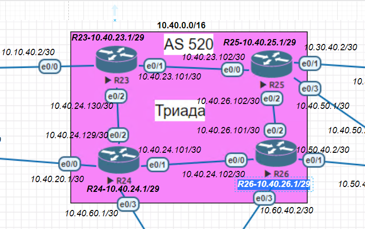
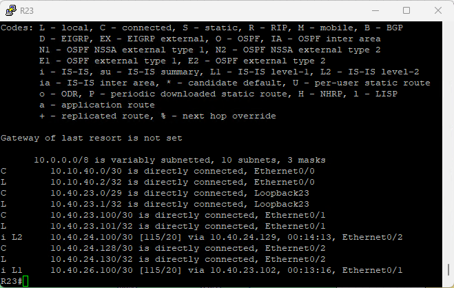
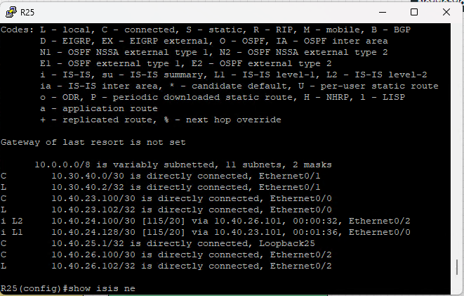
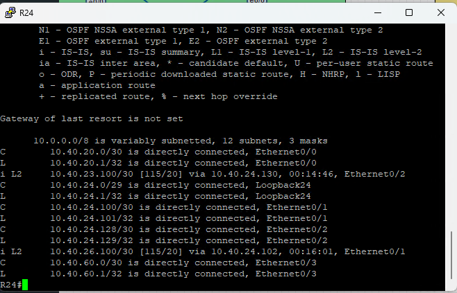
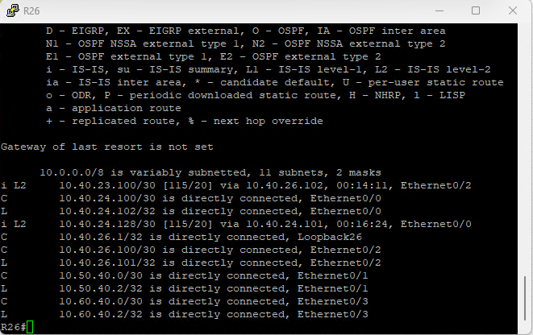

#### IS-IS

1. [Конфигурации устройств](configs/).

##### Задачи:
```
1.Настроите IS-IS в ISP Триада.
2.R23 и R25 находятся в зоне 2222.
3.R24 находится в зоне 24.
4.R26 находится в зоне 26.
Настройка осуществляется одновременно для IPv4 и IPv6.

```


Настрйока на примере каждого роутеров по очередно R23, R25, R24, R26
созадем процесс isis, после чего назначаем зоны. Далее включаем isis на порту
```
R23
conf ter
router isis 23
    net 49.2222.0100.5002.3001.00
interface Ethernet0/1
    ip router isis 23
interface Ethernet0/2
    ip router isis 23

R25
conf ter
router isis 23
    net 49.2222.0100.5002.5001.00
interface Ethernet0/1
    ip router isis 25
interface Ethernet0/2
    ip router isis 25

R24
conf ter
router isis 24
    net 49.0024.0100.5002.4001.00
interface Ethernet0/1
    ip router isis 24
nterface Ethernet0/2
    ip router isis 24

R26
conf ter
router isis 26
    net 49.0026.0100.5002.6001.00
interface Ethernet0/1
    ip router isis 26
nterface Ethernet0/2
    ip router isis 26

```







