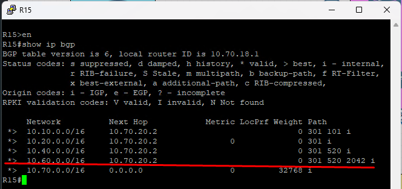

#### BGP. Основы
 1. [Конфигурации устройств](configs/).
 2. 
##### Задачи:
1. Настроите eBGP между офисом Москва и двумя провайдерами - Киторн и Ламас.
Организуете IP доступность между пограничным роутерами офисами Москва и С.-Петербург.
2. Настроите eBGP между провайдерами Киторн и Ламас.
3. Настроите eBGP между Ламас и Триада.
4. Настроите eBGP между офисом С.-Петербург и провайдером Триада.
5. Организуете IP доступность между пограничным роутерами офисами Москва и С.-Петербург.

### Задча: 1. Настроите eBGP между офисом Москва и двумя провайдерами - Киторн и Ламас.
- Поочередно настроим bgp на R14, R15, R21, R22
R14
```
router bgp 1001
 bgp log-neighbor-changes
 network 10.70.0.0 mask 255.255.0.0
 neighbor 10.10.70.1 remote-as 101

ip route 10.70.0.0 255.255.0.0 Null0

```

R15
```
# router bgp 1001
    bgp log-neighbor-changes
    network 10.70.0.0 mask 255.255.0.0
    neighbor 10.70.20.2 remote-as 301

# ip route 10.70.0.0 255.255.0.0 Null0

```

R21
```
# router bgp 301
    bgp log-neighbor-changes
    network 10.20.0.0 mask 255.255.0.0
    neighbor 10.70.20.1 remote-as 1001

# ip route 10.20.0.0 255.255.0.0 Null0

```

R22
```
router bgp 101
# bgp log-neighbor-changes
    network 10.10.0.0 mask 255.255.0.0
    neighbor 10.10.20.2 remote-as 301
    neighbor 10.10.70.2 remote-as 1001

# # ip route 10.10.0.0 255.255.0.0 Null0

```
### Задча: 2. Настроите eBGP между провайдерами Киторн и Ламас
R21
```
router bgp 101
neighbor 10.10.20.2 remote-as 301

```
R22
```
router bgp 301
neighbor 10.10.20.1 remote-as 101

```

### Задча: 3. Настроите eBGP между Ламас и Триада
R21
```
# router bgp 301
    neighbor 10.40.20.1 remote-as 520
```
R24
```
# router bgp 520
    neighbor 10.40.20.2 remote-as 301

# ip route 10.40.0.0 255.255.0.0 null 0
```

### Задча: 4. Настроите eBGP между офисом С.-Петербург и провайдером Триада

R24
```
# router bgp 520
    neighbor 10.40.60.2 remote-as 2042
```
R26
```
# router bgp 520
    bgp log-neighbor-changes
     network 10.40.0.0 mask 255.255.255.248
    neighbor 10.60.40.1 remote-as 2042

# ip route 10.40.0.0 255.255.0.0 Null0
```

R18
```
# router bgp 2042
    bgp log-neighbor-changes
    network 10.60.0.0 mask 255.255.0.0
    neighbor 10.40.60.1 remote-as 520
    neighbor 10.60.40.2 remote-as 520


# ip route 10.60.0.0 255.255.0.0 Null0

```

### Задча: 5. Организуете IP доступность между пограничным роутерами офисами Москва и С.-Петербург
```  
Не совсем понятно, они ведь и так доступны.      
```
R18


R15



R14
