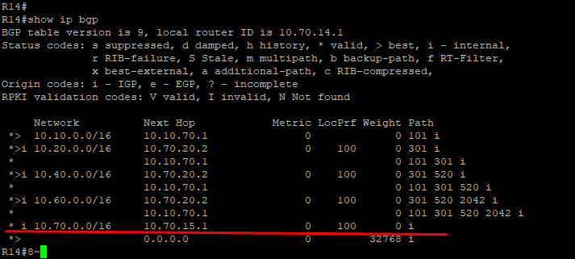
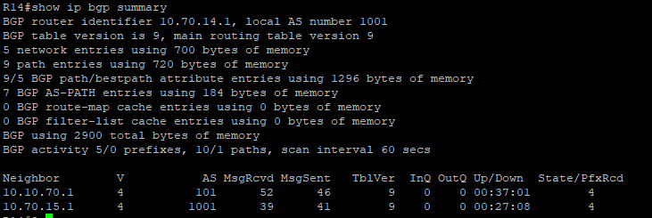
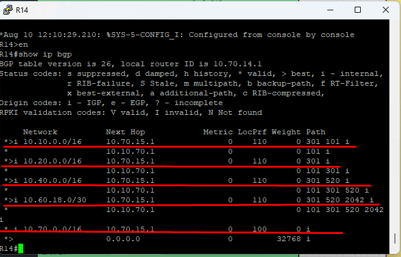
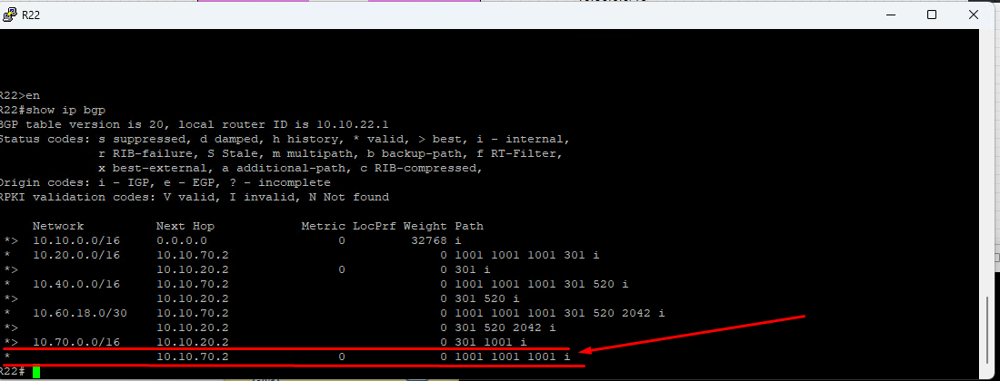
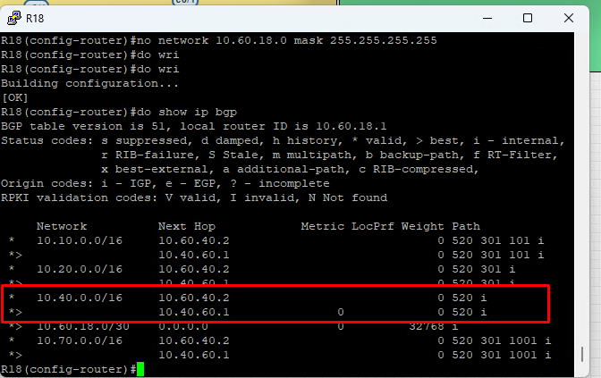

#### iBGP.
 1. [Конфигурации устройств](configs/).

##### Задачи:
1. Настроите iBGP в офисом Москва между маршрутизаторами R14 и R15.
2. Настроите iBGP в провайдере Триада, с использованием RR.
3. Настройте офиса Москва так, чтобы приоритетным провайдером стал Ламас.
4. Настройте офиса С.-Петербург так, чтобы трафик до любого офиса распределялся по двум линкам одновременно.
5. Все сети в лабораторной работе должны иметь IP связность.

### Задча: 1. Настроите iBGP в офисом Москва между маршрутизаторами R14 и R15.


- R14
```
№ router bgp 1001
    neighbor 10.70.15.1 remote-as 1001
    neighbor 10.70.15.1 update-source Loopback1

```

- R15
```
№ router bgp 1001
    neighbor 10.70.14.1 remote-as 1001
    neighbor 10.70.14.1 update-source Loopback1
    neighbor 10.70.14.1 next-hop self
```
Пример с R14



### Задча: 2. Настроите iBGP в провайдере Триада, с использованием RR.
- Настроим R24 и R26 как RR, R23 и R25 - будут клиентами. Так же R24 для R26 будет клиентом и наоборот.

- R24
```
router bgp 520
 bgp log-neighbor-changes
 network 10.40.0.0 mask 255.255.0.0
 neighbor 10.40.20.2 remote-as 301
 neighbor 10.40.23.1 remote-as 520
 neighbor 10.40.23.1 update-source Loopback24
 neighbor 10.40.23.1 route-reflector-client
 neighbor 10.40.23.1 next-hop-self
 neighbor 10.40.26.1 remote-as 520
 neighbor 10.40.26.1 update-source Loopback24
 neighbor 10.40.26.1 route-reflector-client
 neighbor 10.40.26.1 next-hop-self
 neighbor 10.40.60.2 remote-as 2042

```

- R26
```
router bgp 520
 bgp log-neighbor-changes
 network 10.40.0.0 mask 255.255.255.248
 neighbor 10.40.24.1 remote-as 520
 neighbor 10.40.24.1 update-source Loopback26
 neighbor 10.40.24.1 route-reflector-client
 neighbor 10.40.24.1 next-hop-self
 neighbor 10.40.25.1 remote-as 520
 neighbor 10.40.25.1 update-source Loopback26
 neighbor 10.40.25.1 route-reflector-client
 neighbor 10.40.25.1 next-hop-self
 neighbor 10.60.40.1 remote-as 2042

```

- R25
```
router bgp 520
 bgp log-neighbor-changes
 neighbor 10.40.23.1 remote-as 520
 neighbor 10.40.23.1 update-source Loopback25
 neighbor 10.40.23.1 next-hop-self
 neighbor 10.40.26.1 remote-as 520
 neighbor 10.40.26.1 update-source Loopback25
```
- R23
```
router bgp 520
 bgp log-neighbor-changes
 neighbor 10.40.24.1 remote-as 520
 neighbor 10.40.24.1 update-source Loopback23
 neighbor 10.40.25.1 remote-as 520
 neighbor 10.40.25.1 update-source Loopback23
```
- Проверил доступность пингами с R23 и R25 пингом до R18 - у него адрес 
10.60.18.1 пинги проходят.

### Задча: 3. Настройте офиса Москва так, чтобы приоритетным провайдером стал Ламас.
- Настраивать будем приориет в обе стороны.
- Создадим route-map RM-LAMAS и поменяем local-preference на 110, тога маршруты полученные от R15 на R14 будут более приоритетные чем от R22. Это для исходящего трафика.

- R15
```
# route-map RM-LAMAS permit 10
    set local-preference 110
# router bgp 1001
    neighbor 10.70.20.2 route-map RM-LAMAS in 

```
- Проверяем:



- Теперь настрои R14 так - что бы входящийй трафик в Москву был приоритетнее с Ламас, для этого создадим route-map и изменим as-path. Тем самым маршрут до Москвы на Критон R22 будет идти через ЛАМАС.
R14
```
# route-map RM-KITORN-OUT permit 10
    set as-path prepend 1001 1001

# router bgp 1001
    neighbor 10.10.70.1 route-map RM-KITORN-OUT out

```
- Проверяем на R22



### Задча: 4. Настройте офиса С.-Петербург так, чтобы трафик до любого офиса распределялся по двум линкам одновременно.
- Я так понимаю что надо ввести скрытую команду на R18, но почему-то не взлетает.
- R18
```
router bgp 2042
     bgp bestpath as-path multipath-relax

```

- Не понимаЮ

