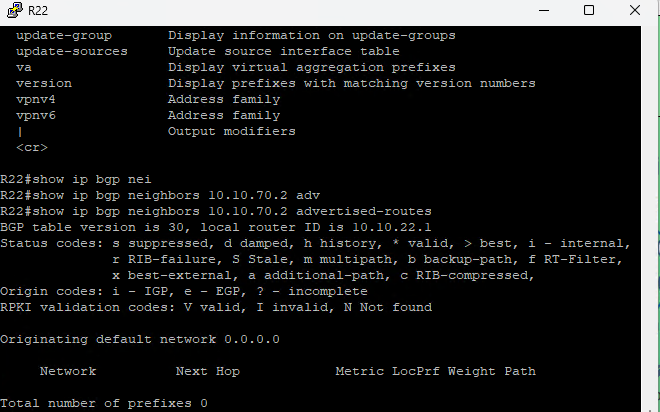
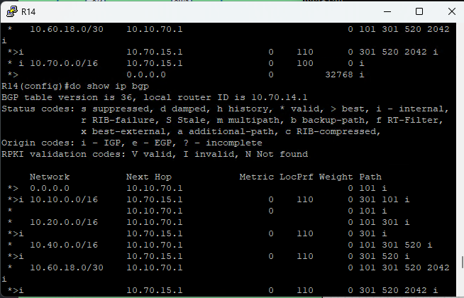
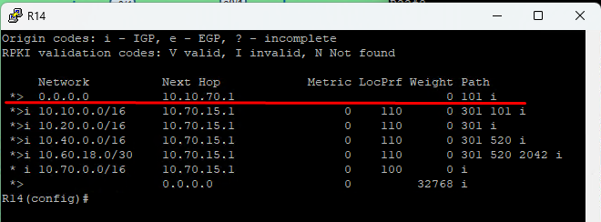

#### BGP. Фильтрация
 1. [Конфигурации устройств](configs/).

##### Задачи:
1. Настроить фильтрацию в офисе Москва так, чтобы не появилось транзитного трафика(As-path).
2. Настроить фильтрацию в офисе С.-Петербург так, чтобы не появилось транзитного трафика(Prefix-list).
3. Настроить провайдера Киторн так, чтобы в офис Москва отдавался только маршрут по умолчанию.
4. Настроить провайдера Ламас так, чтобы в офис Москва отдавался только маршрут по умолчанию и префикс офиса С.-Петербург.


### Задча: 1. Настроить фильтрацию в офисе Москва так, чтобы не появилось транзитного трафика(As-path).


- 
```

```

### Задча: 2. Настроить фильтрацию в офисе С.-Петербург так, чтобы не появилось транзитного трафика(Prefix-list).
- 
```

```

### Задча: 3. Настроить провайдера Киторн так, чтобы в офис Москва отдавался только маршрут по умолчанию.
- Настроим на R22  default-originate и route-map в сторону соседа R14, после настроек на R14 будет отдаваться только маршрут по умолчанию и все остальное будет запрещено.

- R22
```
# router bgp 101
  neighbor 10.10.70.2 default-originate

# route-map MSK-OUT deny 10

# router bgp 101
    neighbor 10.10.70.2 route-map MSK-OUT out

# clear ip bgp * soft out (Обновляем процесс bgp)

#show ip bgp neighbors 10.10.70.2 advertised-routes (проверка какие маршруты мы отправляем соседу) 

```


- Проверяем на R14
- До настроек


- После
 
- остался только маршрут по умолчанию


### Задча: 4. Настроить провайдера Ламас так, чтобы в офис Москва отдавался только маршрут по умолчанию и префикс офиса С.-Петербург.
- Маршрут по умолчанию отпарвим аналогично как на R22 командой default-originate
- Префикс С.-Петербург можно отправить двумя способами регулярным выражением и через prefix-list. 
```

```