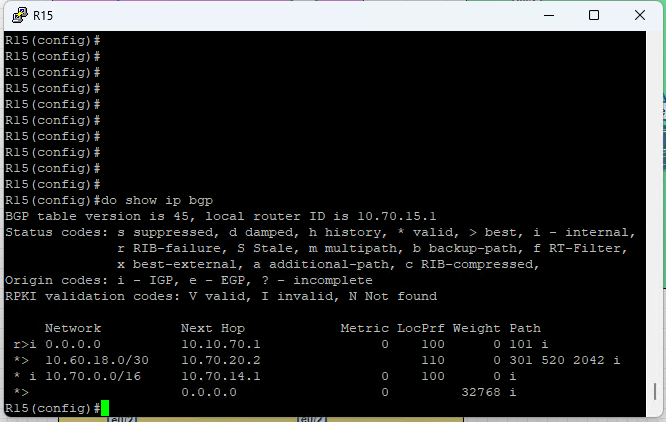
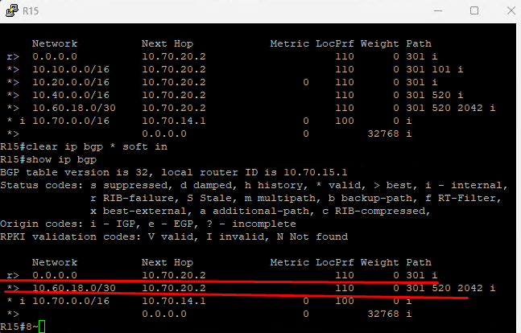

#### BGP. Фильтрация
 1. [Конфигурации устройств](configs/).

##### Задачи:
1. Настроить фильтрацию в офисе Москва так, чтобы не появилось транзитного трафика(As-path).
2. Настроить фильтрацию в офисе С.-Петербург так, чтобы не появилось транзитного трафика(Prefix-list).
3. Настроить провайдера Киторн так, чтобы в офис Москва отдавался только маршрут по умолчанию.
4. Настроить провайдера Ламас так, чтобы в офис Москва отдавался только маршрут по умолчанию и префикс офиса С.-Петербург.


### Задча: 1. Настроить фильтрацию в офисе Москва так, чтобы не появилось транзитного трафика(As-path).
- Допустим что транзитный трафик для Москвы это AS520 Триада, задачу будем выполнять при помощи as-path на R15
- R15
```
# ip as-path access-list 1 permit ^301_.*_2042$ (разрешаем только трафик проходящий чререз соседа для AS-2042)

# router bgp 1001
    neighbor 10.70.20.2 filter-list 1 in

```
- Результат приходит трафик только от AS2042:


- Аналогичные настройки надо выполнить и на R14, только в выражении заменить соседа.
- R14
```
# ip as-path access-list 1 permit ^101_.*_2042$

#router bgp 1001
    neighbor 10.10.70.1 filter-list 1 in
```


### Задча: 2. Настроить фильтрацию в офисе С.-Петербург так, чтобы не появилось транзитного трафика(Prefix-list).
- Предположим что транзитный трафик для СПБ это AS301, задачу будем выполнять при помощу Prefix-list на входящем интерфейсе.
- R18
```

```

### Задча: 3. Настроить провайдера Киторн так, чтобы в офис Москва отдавался только маршрут по умолчанию.
- Настроим на R22  default-originate и route-map в сторону соседа R14, после настроек на R14 будет отдаваться только маршрут по умолчанию и все остальное будет запрещено.

- R22
```
# router bgp 101
  neighbor 10.10.70.2 default-originate

# route-map MSK-OUT deny 10

# router bgp 101
    neighbor 10.10.70.2 route-map MSK-OUT out

# clear ip bgp * soft out (Обновляем процесс bgp)

#show ip bgp neighbors 10.10.70.2 advertised-routes (проверка какие маршруты мы отправляем соседу) 

```


- Проверяем на R14
- До настроек


- После
 
- остался только маршрут по умолчанию


### Задча: 4. Настроить провайдера Ламас так, чтобы в офис Москва отдавался только маршрут по умолчанию и префикс офиса С.-Петербург.
- Маршрут по умолчанию отпарвим аналогично как на R22 командой default-originate
- Префикс С.-Петербург можно отправить двумя способами регулярным выражением и через prefix-list. ОТключим правило созданное в 1 задаче что бы трафик проходил на входящий нитерфейс.
R21
```
# router bgp 301
     neighbor 10.70.20.1 default-originate

# ip as-path access-list 1 permit _2042$

# router bgp 301
     neighbor 10.70.20.1 filter-list 1 out

# clear ip bgp  *  soft out   
```

- Проверяем на R15 До и после настройки as-path:




