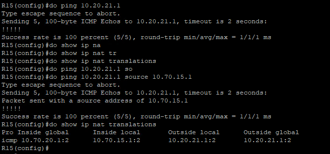
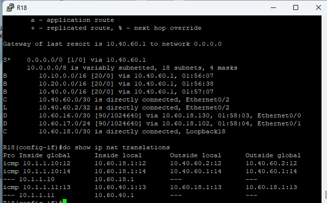
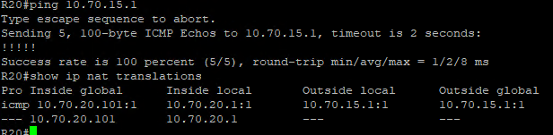
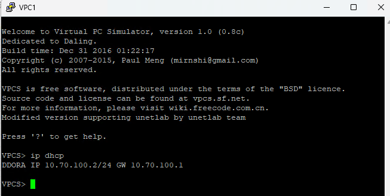
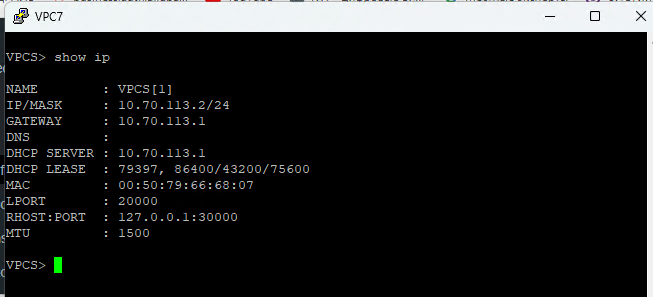
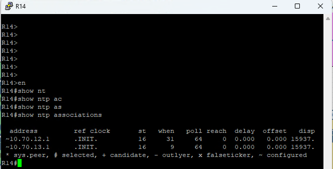

#### Основные протоколы сети интернет
 1. [Конфигурации устройств](configs/).

##### Задачи:
1. Настроите NAT(PAT) на R14 и R15. Трансляция должна осуществляться в адрес автономной системы AS1001
2. Настроите NAT(PAT) на R18. Трансляция должна осуществляться в пул из 5 адресов автономной системы AS2042.
3. Настроите статический NAT для R20.
4. Настроите NAT так, чтобы R19 был доступен с любого узла для удаленного управления.
5. Настроите статический NAT(PAT) для офиса Чокурдах.
6. Настроите для IPv4 DHCP сервер в офисе Москва на маршрутизаторах R12 и R13. VPC1 и VPC7 должны получать сетевые настройки по DHCP.
7. Настроите NTP сервер на R12 и R13. Все устройства в офисе Москва должны синхронизировать время с R12 и R13.
8. Все офисы в лабораторной работе должны иметь IP связность.
### Задча: 1. Настроите NAT(PAT) на R14 и R15. Трансляция должна осуществляться в адрес автономной системы AS1001
- Создадим access-list, полче чего создадим правило nat
 R14
```
# access-list 100 permit ip 10.70.0.0 0.0.255.255 any
# ip nat inside source list 100 interface Ethernet0/2 overload

# int e0/2
    ip nat outside
    ip nat enable

# int loopback 1
    ip nat inside

```
- но почему то ничего не показывает в Show ip nat translations - не пойму что нужно сделать

- R15
```
# access-list 113 permit ip 10.70.0.0 0.0.255.255 any
# ip nat inside source list 113 interface Ethernet0/2 overload

# int e0/2
    ip nat outside
    ip nat enable
# interface loopback 1
    ip nat inside

```
- проверка для R15



### Задча: 2.Настроите NAT(PAT) на R18. Трансляция должна осуществляться в пул из 5 адресов автономной системы AS2042.
- кому должен принадлежать pool или он может быть рандомным??? 
```
# ip nat pool POOL_NAT 10.1.1.10 10.1.1.20 netmask 255.255.255.0

# access-list 2042 permit ip 10.60.0.0 0.0.255.255 any

# interface Ethernet0/2
 ip nat outside

interface Loopback1
 no ip address
 ip nat outside
 ip virtual-reassembly in


# ip nat inside source list 2042 pool POOL_NAT

```
- перестали работать пинги с R18 но зато show ip nat появился.



### Задча: 3.Настроите статический NAT для R20
-  
```
# ip nat inside source static 10.70.20.1 10.70.20.101

# interface Ethernet0/0
 description to_R15_e0/3
 ip address 10.70.20.101 255.255.255.252
 ip nat outside

# interface Loopback1
 ip address 10.70.20.1 255.255.255.248
 ip nat inside
 ip virtual-reassembly in

```
- проверка:



### Задча: 4.Настроите NAT так, чтобы R19 был доступен с любого узла для удаленного управления.
- Не пойму что надо сделать, пробросить NAT 22, 23 порт  проброс порта из вне?
```


```
### Задча: 5.Настроите статический NAT(PAT) для офиса Чокурдах.
- не пойму что надо сделать? 
```
```
### Задча: 6.Настроите для IPv4 DHCP сервер в офисе Москва на маршрутизаторах R12 и R13. VPC1 и VPC7 должны получать сетевые настройки по DHCP.
- R12 
```
# ip dhcp pool VLAN100
 network 10.70.100.0 255.255.255.0
 default-router 10.70.100.1
 domain-name moscow.ru

# interface Ethernet0/0.100
 description to_SW4
 encapsulation dot1Q 100
 ip address 10.70.100.1 255.255.255.0

```
- на коммутаторах создаем vlan, настраиваем порты в нужном режиме работы пример на ыц3 конечный коммутатор для vpc1

```
interface Ethernet0/0
 description to_Sw4_e0/0
 switchport trunk encapsulation dot1q
 switchport mode trunk


interface Ethernet0/2
 description tVPC1
 switchport access vlan 100
 switchport mode access

```

- Аналогичные настройки делаем на R13 только другой влан
```
ip dhcp pool VLAN113
 network 10.70.113.0 255.255.255.0
 default-router 10.70.113.1


interface Ethernet0/0.113
 description DHCP_VLAN113
 encapsulation dot1Q 113
 ip address 10.70.113.1 255.255.255.0

```


### Задча: 7.Настроите NTP сервер на R12 и R13. Все устройства в офисе Москва должны синхронизировать время с R12 и R13.
- Настроим ntp на R12 и R13 в качестве сервера. Сделаем это на lopback. ТАк же на R12 и R13 сделаем их клиентами по отношению друг к другу.
- R12
```
# interface Loopback1
 ip address 10.70.12.1 255.255.255.248
 ntp broadcast
# ntp server 10.70.13.1
```
- аналогичные настройки на R13, далее настроим все устройства как клиенты ntp
- R14 для примера, остальные по аналогии
```
# ntp server 10.70.12.1
  ntp server 10.70.13.1

```
- Проверка:



### Задча: 8.Все офисы в лабораторной работе должны иметь IP связность.

- Она вроде и так была. Или надо почистить все фильтры в BGP? Правда у меня почему-то VPC7 никого не видит.
```
```
text